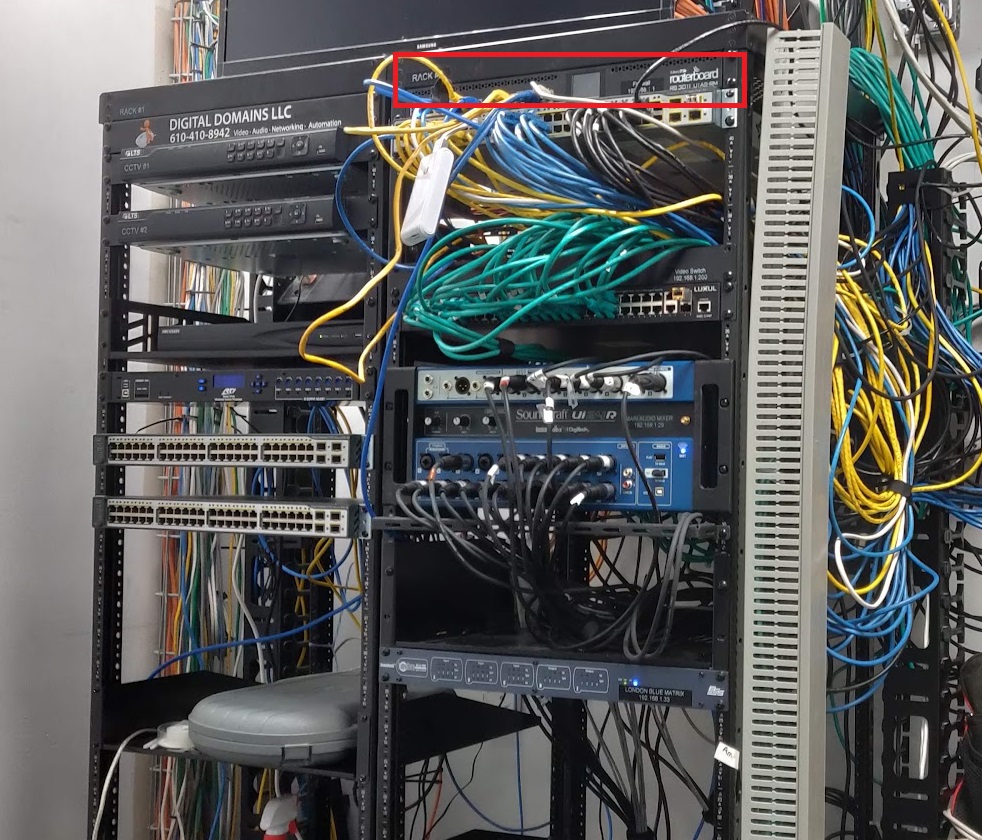
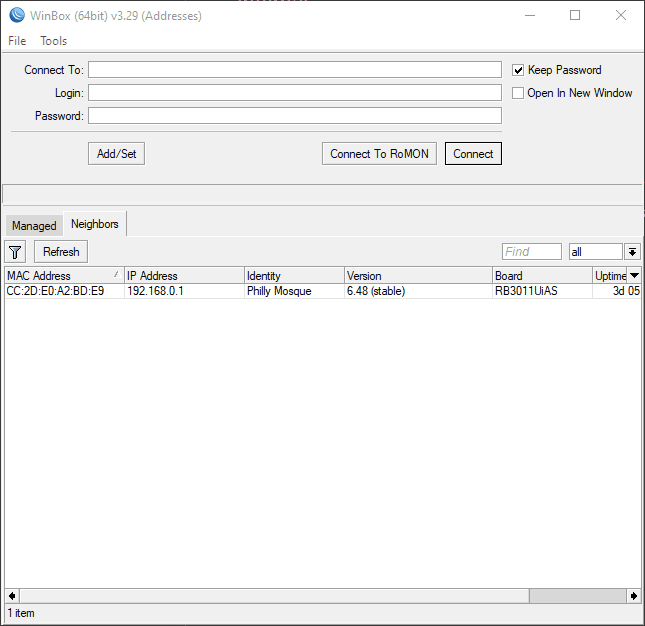
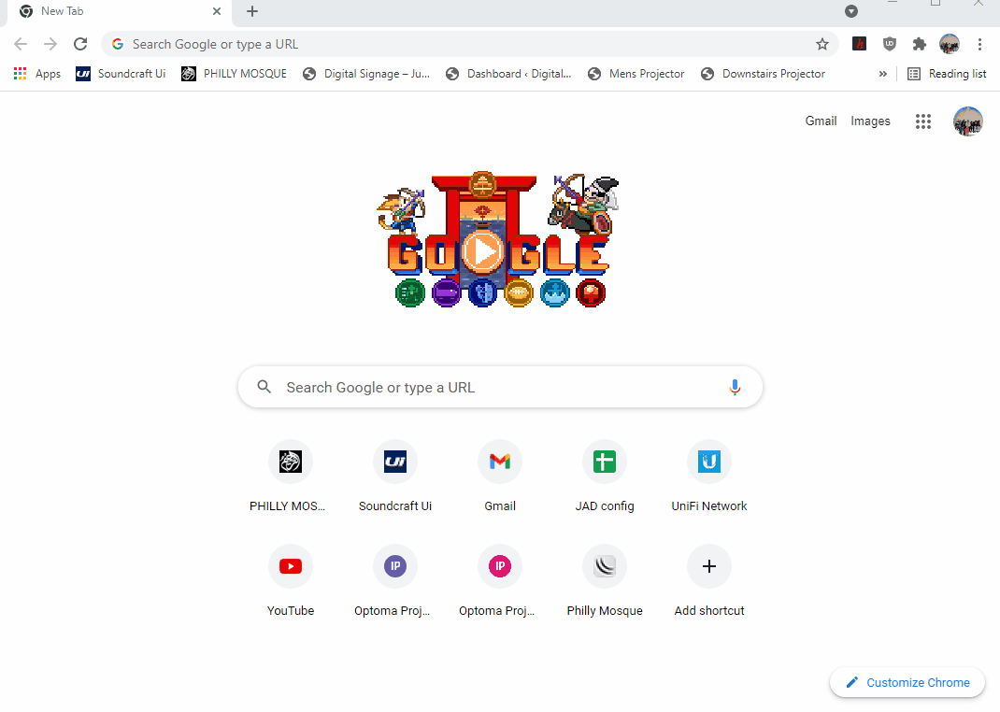

# Guide
This helps any additional resources begin to understand how to use the AV system.

# Index

## Internet

1. [Internet](#Internet)  
    1. [Router](#router)  
        1. [Logging In](#Logging-in)  
            (how to access the router from home or the mosque)
        2. [Configuration](#Configuration)  
            (how to backup and restore configuration from a backup file)
    2. [Wifi](#wifi)  
    3. [Ethernet Switch](#Ethernet-Switch) 
    4. [Video Switch](#Video-Switch)

# Internet

## Router

Our internet router is inside the Audio video room, on the right server rack, on the very top, we own a Mikrtotik Router

## Logging in
----

## <u>Accessing Router Using winbox</u>

    IP address internal is 192.168.0.1 (Default gateway of internal connection)
    IP address external is 108.2.217.186 (mosque static ip)

1. to use winbox download [winbox](./programs/winbox64.exe)
2. if your outisde use external ip if your inside use internal

username: `ddomains`

password `ddomains924`

## <u>Access router from Browser</u>

    your local ip address for the browser on the mosque network is 192.168.0.1
credentials are 

username: `ddomains`

password `ddomains924`

Login using any browser that is on the master network for the mosque. Hardwired or Adminwifi

## Configuration
----

In this section we will demontrate how to backup and restore the configuration of the main internet router. This entire building has a Fios line that feeds a direct ethernet connection from an [ONT](https://i.imgur.com/ZJi1wzY.jpeg) which is located in the plumbing room in the corner of the mosque downstairs in the ladies hallway. This room has plumbing and this ONT, at this location we route an ethernet wire all they way through the building and DIRECTLY into the Mosque Router. 

## <u>Backing up and restoring a configurationfile</u>

Once a user logs into the router, you want to click on `file` on the menu in the left bar, then click backup to save a configuration snapshot of your router. 

    always use the format of dateyearpassword, for example "August2021backup" this will save a file named "August2021backup" and the password should be chosen to match the end, which means the password id "backup". 

To restore configurations just click restore and choose the restore file. The restore password should be written in the name of the file. Once a file is chosen and restore is clicked you will reboot the modem. You should lose connection at this point as the modem reboots. 

    If you screw up managing the router through your remote connection on VNC, then you can use winbox from your own PC at home also, this will allow you to save yourself a trip to the mosque. 
----
    
Save Files samples are stored [here](./backup_items/Main_Router/backupfiles.zip) <- click to download Guide/backup_items/Main_Router/backupfiles.zip
----

## WIFI
----

Wifi uses a Unifi Ubiquity system as a mesh wifi interface. 
you must be inside the mosque internet connection to access this system
connect by using http://192.168.1.16:8443/

username: aafiyat
password: Aafiyat